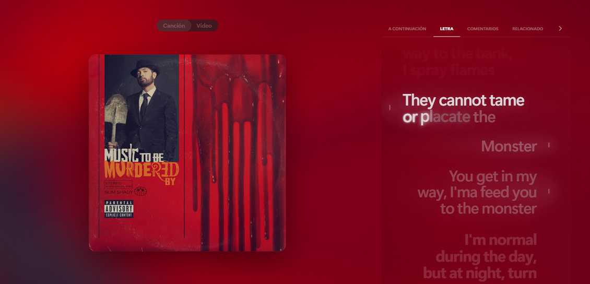

# Lyric Glow

[](https://github.com/MatiuxXcd/lyric-glow)
[](https://github.com/MatiuxXcd/lyric-glow)

An immersive Better Lyrics theme focused on cinematic album-art ambience, fluid lyric motion and clean typography.



## Features

- Diffuse active-line Lyric Glow
- Native Better Lyrics rich-sync animations
- Readable upcoming-lyric hierarchy
- Voice-aware secondary and shared-vocal layouts
- Translation and romanization styling
- Dynamic album-art ambience
- Glass navigation, dialogs, menus and queue
- Responsive desktop/fullscreen layout
- Reduced-motion and increased-contrast support

## Install

In Better Lyrics:

1. Open **Themes**.
2. Choose **Install from URL**.
3. Enter:

```text
https://github.com/MatiuxXcd/lyric-glow
```

After Marketplace approval, Lyric Glow can also be installed directly from the Better Lyrics Theme Store.

## Theme Metadata

- **ID:** `lyric-glow`
- **Version:** `1.3.1`
- **Minimum Better Lyrics:** `2.4.0.1`
- **Creator:** [MatiuxXcd](https://github.com/MatiuxXcd)

## Development

The main stylesheet is `style.css`.

Better Lyrics owns rich-sync word timing and motion through its animation engine. Lyric Glow deliberately avoids overriding word-level transforms so native swipe/wobble/glow behavior remains intact.

The **Better Lyrics engine knobs** block inside `style.css` is intentionally a CSS comment because Better Lyrics parses those values at runtime.

## Credits

Created by **MatiuxXcd**.

Portions of the early selector/layout foundation were derived from [Lucid](https://github.com/drago-oo/lucid-theme) by **drago-oo** (MIT). Lyric Glow was extensively redesigned around a different lyric stage, hierarchy and visual system.

Apple Music is a trademark of Apple Inc. This project is unofficial and is not affiliated with or endorsed by Apple.

## License

MIT. See [LICENSE](LICENSE) and [NOTICE.md](NOTICE.md).
